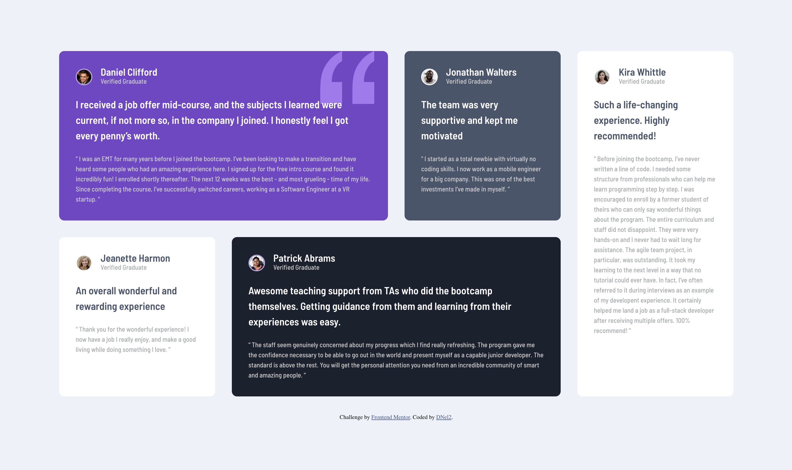

# Frontend Mentor - Testimonials grid section solution

This is a solution to the [Testimonials grid section challenge on Frontend Mentor](https://www.frontendmentor.io/challenges/testimonials-grid-section-Nnw6J7Un7). Frontend Mentor challenges help you improve your coding skills by building realistic projects. 

## Table of contents

- [Overview](#overview)
  - [The challenge](#the-challenge)
  - [Screenshot](#screenshot)
  - [Links](#links)
- [My process](#my-process)
  - [Built with](#built-with)
  - [What I learned](#what-i-learned)
  - [Continued development](#continued-development)
  - [Useful resources](#useful-resources)
- [Author](#author)

## Overview

### The challenge

Users should be able to:

- View the optimal layout for the site depending on their device's screen size

### Screenshot

### Links

- Solution URL: [Solution URL here](https://github.com/TechEdDan2/TestimonialsGridSection)
- Live Site URL: [Live site URL here](https://techeddan2.github.io/TestimonialsGridSection/)

## My process

I started this project a while ago, but didn't have any experience with grid, which is how I was trying to style it. I stopped and then recently came back to it after watching a YouTube video by Kevin Powell on how to approach this challenge. I had already made my HTML layout, so I was adapting what I had already created with pointers from the video, so the CSS isn't as clean as it could be. My HTML was also a little messy and over engineered.  

### Built with

- Semantic HTML5 markup
- CSS custom properties
- Flexbox
- CSS Grid
- Mobile-first workflow

### What I learned

I learned a lot about Grid from completing this challenge. Up until now I only used flexbox for controlling layout and responsive design because I haven't really learned a lot about how to set it up. I'm looking forward to using more grid in the future. 

### Continued development

I'm going to continue to try using Grid in different projects to practice. 

### Useful resources

- [MDN](https://developer.mozilla.org/en-US/docs/Web/API/Document_Object_Model) - This helped me when using the Document Object Model to create this project. 
- [Udemy](https://www.udemy.com/course/the-web-developer-bootcamp) - This Udemy course has helped to learn how to use the DOM. I'd recommend it to anyone still learning this concept.
- [YouTube: Kevin Powell](https://youtu.be/rg7Fvvl3taU?si=t8x5nKKq4dzt7tot) - After I got stuck trying to learn Grid on my own, I watched this video by Kevin Powell to help with my mistakes. 

## Author

- Website - [Add your name here](N/A)
- Frontend Mentor - [@TechEdDan2](https://www.frontendmentor.io/profile/TechEdDan2)
- Twitter - [@TechEdDan](https://twitter.com/TechEdDan)

